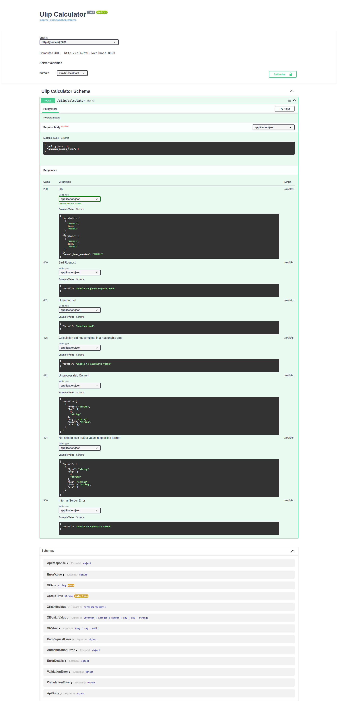

# JSON API Mode

JSON API mode lets any HTTP client send requests to your Endpoint and receive JSON
responses.

## Enabling JSON API mode

Open the Endpoint in RuleX Admin and enable **JSON API** under the Modes section.
Then assign an **[API Config](api-config.md)** to the Endpoint. The API Config provides the API key
that clients must include with every request.


The Endpoint is not reachable until both conditions are met: the **[Data Source](../concepts/data-sources.md)** has
finished compiling, and an API Config is assigned.

## Making a request

Send a `POST` request to your Endpoint URL with `Content-Type: application/json`.
The request body is a JSON object with the **[Schema](../concepts/endpoint-schemas.md)** input field names as keys.

```http
POST https://example.rulex.coverstack.in/calculate/price
Authorization: Bearer <your-api-key>
Content-Type: application/json

{
  "quantity": 10,
  "unit_price": 4.5
}
```

The response is a JSON object with the **[Schema](../concepts/endpoint-schemas.md)** output field names as keys.

```json
{
  "total": 45.0,
  "discount": 0.0
}
```

Optional inputs can be omitted from the request body.

## API docs

Each JSON API Endpoint has a Swagger UI page where you can explore the request and
response schema and try out calls directly from the browser.

Open the Endpoint in RuleX Admin and click **View API Docs**.


