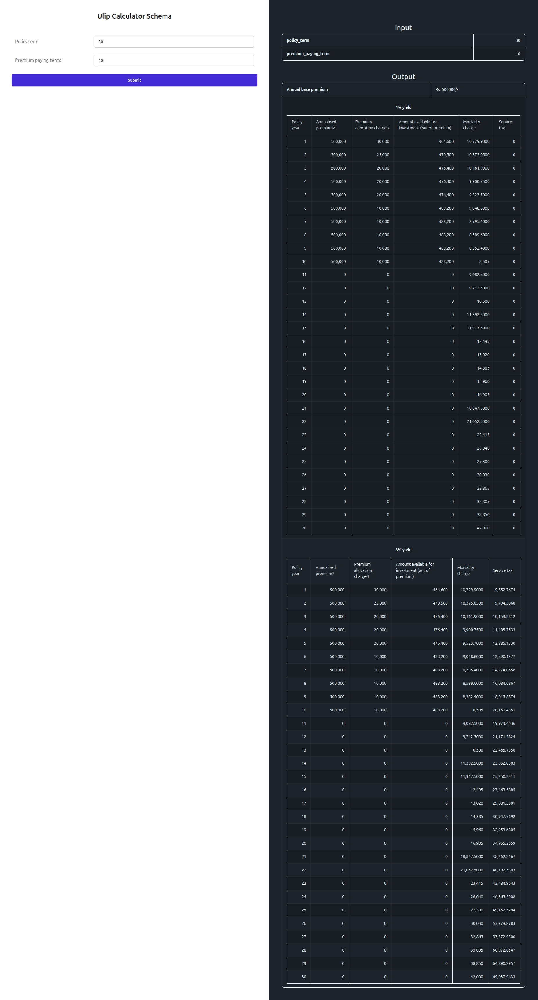

# Web Form Mode

!!! info "Full access feature"
    Web Form Mode requires full hosted access.
    [Learn more](../full-access-features.md)

Web Form Mode exposes an **[Endpoint](../concepts/endpoints.md)** as an HTML form in the browser. Visitors fill in
the inputs, submit the form, and see the results on the same page without writing
any code.

## Enabling Web Form Mode

Open the Endpoint in RuleX Admin and enable **Web Form** under the Modes section.
Then assign at least one **[Web Form Credential](web-form-credentials.md)** under the
**Authenticated Users** field.

## The web form

The fields correspond to the inputs defined in the **[Schema](../concepts/endpoint-schemas.md)**.
Each field type maps to an appropriate input control: text, number, date picker, dropdown for booleans, and so on.

The form validates each field as you type. Errors from data validations configured
in Excel appear inline next to the relevant field.

After submitting, the results appear beside the form.

## Accessing the web form URL

Open the Endpoint in RuleX Admin and click **View Web Form**. This opens the form
URL in your browser. Share this URL directly with your users.
