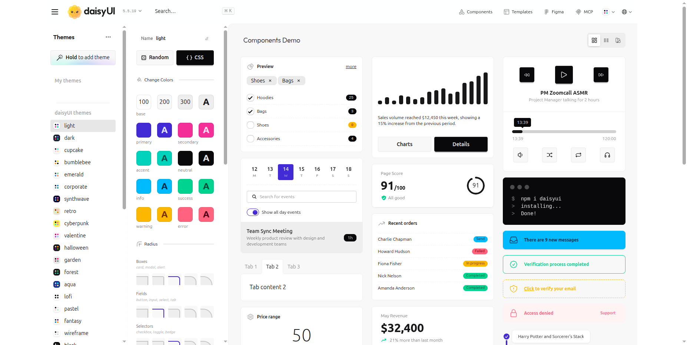
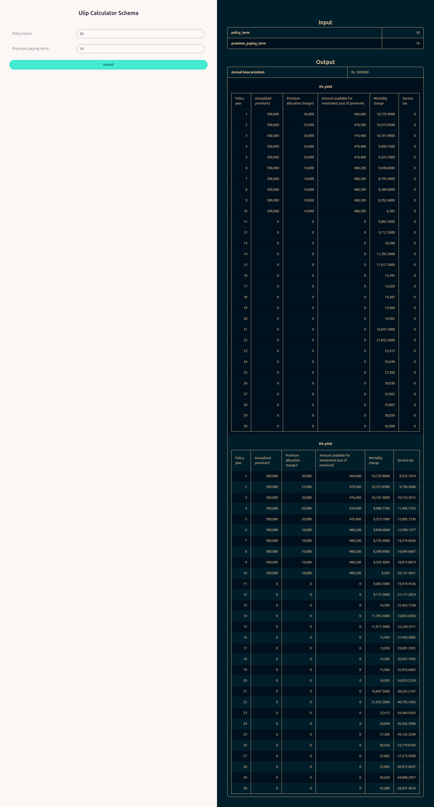

# Web Form Themes

!!! info "Full access feature"
    Web Form Themes require full hosted access.
    [Learn more](../full-access-features.md)

Themes let you customise the appearance of your web forms using
[daisyUI](https://daisyui.com/theme-generator/). You can define separate styles for
light mode and dark mode. RuleX applies the correct style based on the visitor's
system preference.

## Creating a theme

Go to the **Endpoint** in RuleX Admin and click the plus button (+) in Theme field of Web form config section.
Give it a name, and save.

Open the [daisyUI theme generator](https://daisyui.com/theme-generator/) and customise
your colours.

Copy the URL from the browser address bar and paste it into the **Light theme URL**
or **Dark theme URL** field. You can provide one or both.

- If you provide both, RuleX applies each based on the visitor's system preference.
- If you provide only a light theme, it is used in light mode only. Dark mode falls
  back to the default styling.
- If you provide only a dark theme, it is used in dark mode only.

## Styled Web Form

