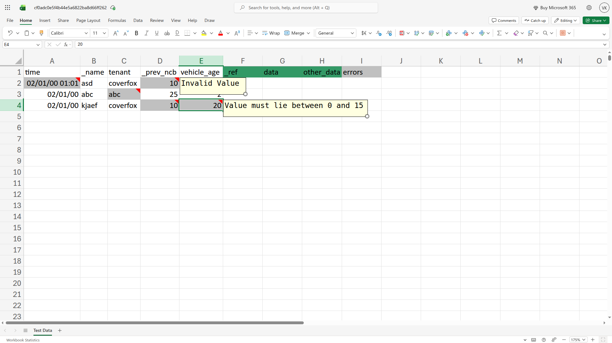

# Endpoint Tests

!!! info "Full access feature"
    Endpoint Tests require full hosted access.
    [Learn more](full-access-features.md)

Endpoint Tests let you run an **[Endpoint](concepts/endpoints.md)** against many input combinations at once.
You upload an Excel file where each row is a test case.
RuleX processes every row of every sheet and returns a results file with inputs and outputs side by side.

## Preparing the test file

Open the Endpoint in RuleX Admin and click **Download Sample Test Excel** under **Run Tests** dropdown.
The sample file has one column per **[Schema](concepts/endpoint-schemas.md)** input, with the correct headers already filled in.

Add your test data, one row per test case, and save the file.

## Running a test

Click **Upload Test Excel** on the Endpoint page and select your file.

RuleX runs each row through the model. The test goes through these statuses:

| Status | Meaning |
|---|---|
| Pending | Queued |
| Executing | Running |
| Completed | Done, results ready |
| Failed | Something went wrong |

## Downloading results

Once the status is Completed, click **Download** to get the results file. It contains
all your input columns plus one column per Schema output.
If any of the input data fails the Data Validation rules, it is highlighted with an error note.

Output cells that contained a formula error (such as `#VALUE!`) appear as that error
string in the results file, exactly as Excel would display them.

!!! note
    If you have used formulas to derive input data, only the computed value at the time
    of file save is read as the input. RuleX does not evaluate the formulas.

    Results are written directly into the uploaded Excel file as new columns. Existing
    data, formulas, and formatting are left intact.
