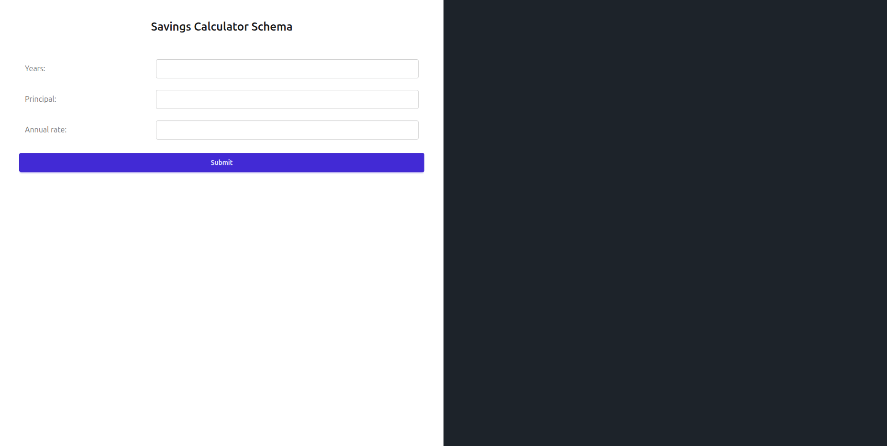
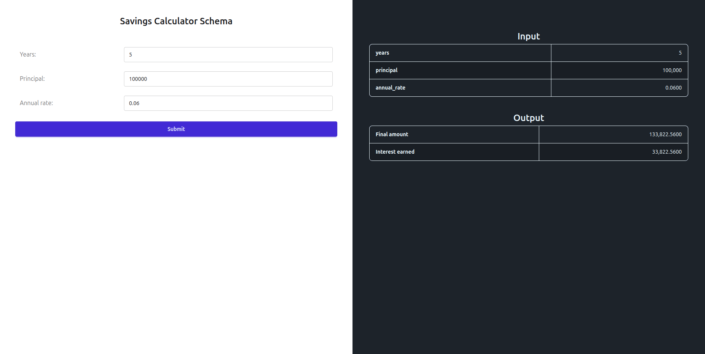

# 7. Publish a Web Form

!!! info "Full access feature"
    Web Form Mode requires full hosted access.
    [Learn more](../full-access-features.md)

In the previous steps you set up a JSON API for your bank partners. Now you will publish
a web form on the same model so customers can use the calculator directly in the browser,
without writing any code.

## Enable Web Form Mode

1. Open your `/savings/projection` Endpoint in RuleX Admin.
2. Under **Modes**, enable **Web Form**.
3. Under **Authenticated Users**, add a **[Web Form Credential](../configuring/web-form-credentials.md)**.
   This is the username and password your customers will use to log in.
4. Click **Save**.

## Share the form with customers

1. Click **View Web Form** on the Endpoint page.

The form opens in your browser. It has one field for each Schema input:
`principal`, `annual_rate`, and `years`.

Customers fill in the fields and click **Submit**. The results appear beside the form.

Share this URL with your customers. When they open it, they will be prompted to log in
with the credentials you configured under **Authenticated Users**. Anyone with valid
credentials can access the form.

!!! note
    If you add a fixed input to this endpoint, those fields will not appear in the form.
    Customers only see and interact with the inputs that are not locked in.
